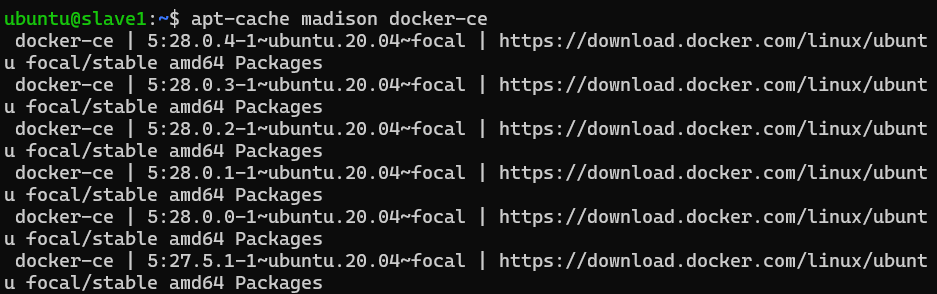
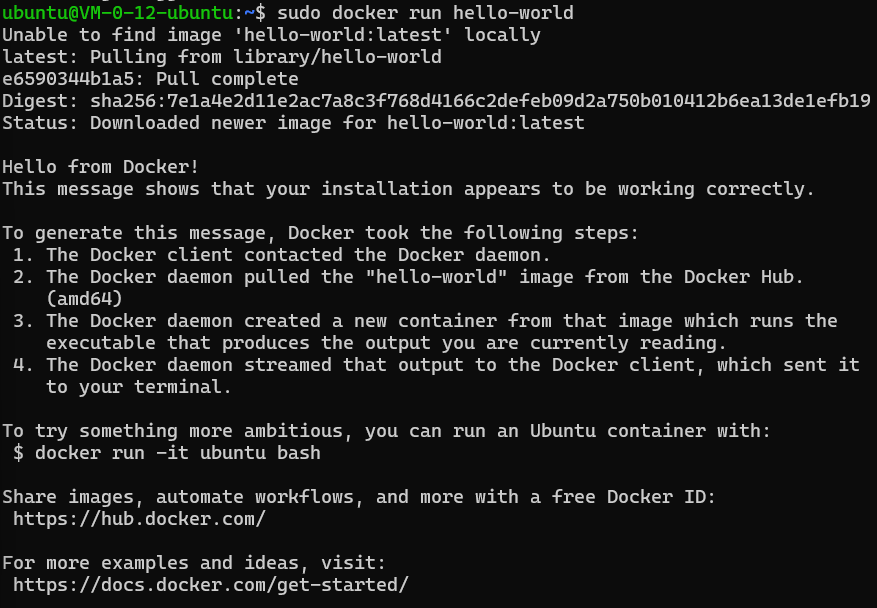
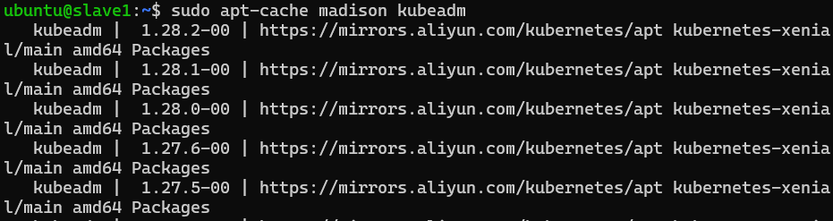
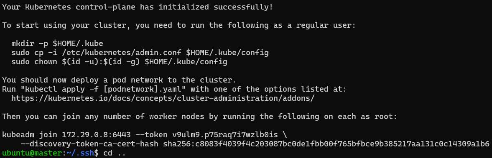
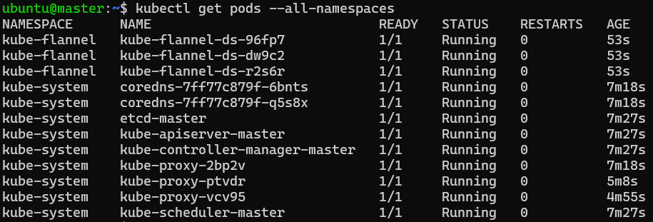
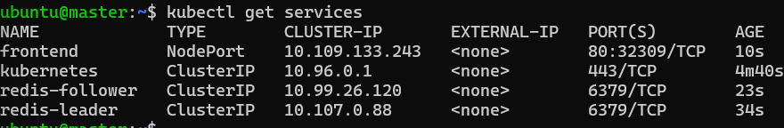
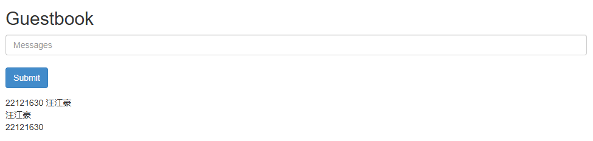

### 实验二 基于Kubernetes的高可用Redis数据库

*22121630 汪江豪*

- 先从腾讯云上租借一台服务器，并到Docker官网，输入以下命令安装Docker到ubuntu系统中。

```shell
# Add Docker's official GPG key:
sudo apt-get update
sudo apt-get install ca-certificates curl
sudo install -m 0755 -d /etc/apt/keyrings
sudo curl -fsSL https://download.docker.com/linux/ubuntu/gpg -o /etc/apt/keyrings/docker.asc
sudo chmod a+r /etc/apt/keyrings/docker.asc

# Add the repository to Apt sources:
echo \
  "deb [arch=$(dpkg --print-architecture) signed-by=/etc/apt/keyrings/docker.asc] https://download.docker.com/linux/ubuntu \
  $(. /etc/os-release && echo "${UBUNTU_CODENAME:-$VERSION_CODENAME}") stable" | \
  sudo tee /etc/apt/sources.list.d/docker.list > /dev/null
sudo apt-get update
```

​	查看docker版本号列表

```sh
apt-cache madison docker-ce
```



​	运行示例程序hello-world



​	成功输出，说明Docker安装成功。

- 安装Kubernetes
  - 先将镜像换源成阿里后，查看可安装的版本号,然后安装相应版本（注意尽量安装Docker和K8s相同版本）

```sh
sudo apt-cache madison kubeadm
```



- 通过openssh-server创建公钥密钥，添加到authorized_keys后，保存该镜像。
- 从腾讯云上再创建2个该镜像服务器，并通过ssh设置3台节点的无密码连接，设置主机名分别为master,slave1,slave2。
- 在master节点上启动k8s集群：

```sh
# 关闭虚拟内存
sudo swapoff -a

# 初始化单节点集群（address切换成自己的内网ip）
sudo kubeadm init --apiserver-advertise-address=172.29.0.8 --image-repository registry.aliyuncs.com/google_containers --service-cidr=10.96.0.0/12  --pod-network-cidr=10.244.0.0/16
```



​	看到生成的随机token表示启动成功。

- 到slave1和slave2节点先关闭虚拟内存，再将上图最后两行命令前加上sudo，运行。让这两个节点加入k8s集群。
- 回到master节点，配置kubectl客户端的访问权限，下载网络插件，并列出集群所有命名空间下的pod

```sh
# 配置 kubectl 的客户端访问权限
mkdir -p $HOME/.kube
sudo cp -i /etc/kubernetes/admin.conf $HOME/.kube/config
sudo chown $(id -u):$(id -g) $HOME/.kube/config

# 下载网络插件
kubectl apply -f https://raw.githubusercontent.com/coreos/flannel/master/Documentation/kube-flannel.yml


```



​	STATUS一栏全部显示Running，表示成功，随后开始部署redis。

- 创建4个文件redis-follower-deployment.yaml，redis-leader-deployment.yaml，redis-follower-service.yaml，redis-leader-service.yaml，并输入:

```sh
kubectl apply -f [文件名]
```

​	应用这4个文件。

- 创建前端配置文件frontend-deployment.yaml,frontend-service.yaml并同样应用，

```sh
kubectl get services
```

​	随后查看正在运行的服务：



可以看到，前端页面暴露在32309端口。

- 随后在腾讯云上，修改3台结点的安全组入站规则，暴露TCP:32309端口，允许所有地址入站。
- 打开本地浏览器，输入三台结点任意一台的公网IP地址，加上:32309，跳转到前端页面。输入信息并提交，成功存储。



至此，基于基于Kubernetes的高可用Redis数据库及其前端页面搭建完成，实验成功。